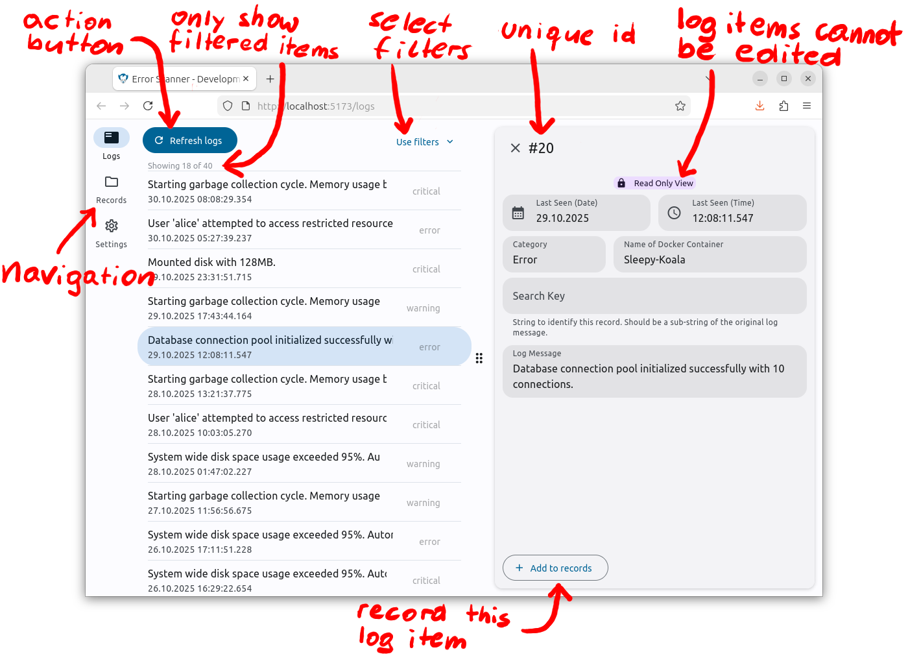
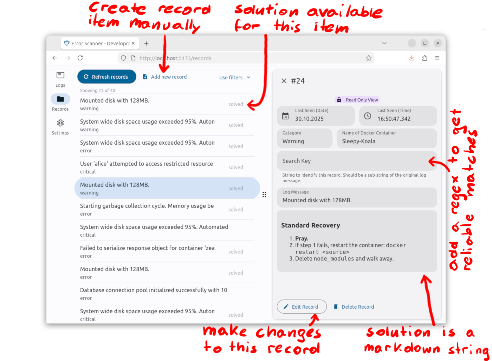
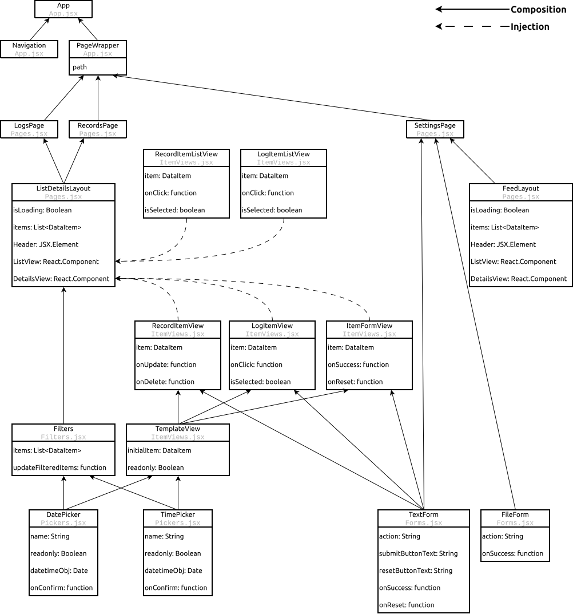

# Frontend
The frontend implements the user interface. The user can view logs and records, edit them and make changes to the configuration in the settings. 

The user interface is implemented to be responsive and works on any screen size. Its design and colors follow the principles of Material Design M3 ([see more details](https://m3.material.io/)).


## Usage
It user interface is a web page implemented with React. In total there are three visible pages: *Logs*, *Records* and *Settings*. The first two pages show logs/records that were processed by the scanner. The user can view, filter and sort these items. On the third page the configuration settings can be updated. Some changes take effect immediately, some require a restart of the application.


### Logs & Records
The first page shows **logs** from relevant Docker containers. Which containers are relevant, depends on the whitelist and blacklist in the settings. Log message strings from these containers are parsed and converted into log items. Any existing log items are deleted every time the scanner restarts and re-scanned from the Docker logging.

Log items can be recorded to keep them permanently. The other page shows these **records**. Logs can be recorded either manually or automatically. The user can also add a new record without any existing log.

Both pages show the items in a list-details-layout. The user can click any list item to see more details. In the details panel they can perform further actions on that item.


#### Logging
Every log item is defined based on the container that generated it, their timestamp and the category. In total there are five categories: critical, error, warning, info and debug. The category is parsed based on a pre-defined sub-string in the message string, a *tag* (e.g. "[ERROR]"). The user can change the tag for each category in the settings. If the message string does not include any tag, it is categorized as "critical".

The user can enable, which category of messages are actually logged and which ones are ignored. Only logged messages will be visible on this page. This helps to reduce disk usage. By default *critical*, *error* and *warning* are logged. These settings are independent from the Auto-Recording feature.

Log items are immutable and are read only. Logs cannot be edited but records can be edited! The user can add any log item to the records database and then make changes.




#### Records
Records are items that were previously added to permanent storage. Records are stored in a SQL database. More an that can be read in the [backend documentation](./../backend/README.md). Records were either added directly by the user or they were logs that were recorded either manually or automatically:
    
1. The users adds a new record directly, clicking the button "*Add new record*" on the *Records* page.
2. The users records an existing log manually, using the button "*Add to records*" at the bottom of log details.
3. The user enabled auto-recording for a category (e.g. error). This means any time a log has this category, it gets automatically recorded. This is the default way to add new records! If a matching record already exists, the system simply updates the existing record's timestamp instead of creating a duplicate. For a log to match an existing record, they must share the same container, the same category, and similar message strings.

When the user clicks on any record item in the list, they can see more details about that record. By default these are read-only, but the user can make changes to any record by clicking the *Edit Record* button at the bottom.

Since automated string similarity is not always perfect, the user can use a **matching pattern** to ensure reliable matching. A matching pattern is a regular expression (Regex) to identify a record based on its message string. This helps the system to check if a matching record already exists. Should be as strict as possible to prevent false positive matches. If the system finds a matching string within a new log, it is automatically a match to that record.





#### Filters
Additional filters help to sort and search the items. The user can search for key words and filter timestamps and categories.
- Enter multiple **key words** separated by spaces to search for particular records. For a text search the following attributes are considered: ID, name of the container, match pattern, solution string and the message string. The result has to contain all(!) key words at least once.
- Narrow the search by selecting the earliest and latest timestamp of the interesseting items. By default these are set to earliest and latest timestamps of all items.
- Select and unselect which category of items to show


### Settings
This page lets the user change configuration values. Each section has its own set of settings. The user can tweak the settings or reset them to the original state. Changes are only confirmed after the user clicked "*Save changes*".


#### Docker Interface
The scanner is designed to run as an independent Docker container. Its primary goal is to identify a Watchlist of relevant containers to monitor.

Defining the Universe: The Universe is the total pool of containers available for scanning. This is determined in one of three ways:
1. Automatic Mode (Default): The scanner identifies all containers sharing its Docker network (e.g. within the same docker-compose file). Each network is considered a Galaxy; if the scanner is attached to multiple networks, the sum of these galaxies forms the Universe.
2. Network Override: You can manually specify a Docker Network Name in the settings. The scanner will then consider all containers in that specific network as the Universe, even if the scanner itself is not a member.
3. System Fallback: If the scanner is not part of a network and no override is provided, all containers on the entire host system are treated as the Universe. Note: This is a fallback behavior and is not recommended for production.

Filtering the Watchlist: Once the Universe is established, the final Watchlist is generated by applying Whitelist and Blacklist filters. Ensure that no container name or ID appears on both lists simultaneously!
- Whitelist: If defined, only containers in the Universe that match the whitelist (by name or ID) are scanned. If the whitelist is empty, the entire Universe is included by default.
- Blacklist: Any containers listed here are strictly excluded from the final Watchlist, overriding the whitelist.


#### Log Scanner
The scanning behavior can be configured. To categorize log string messages, they are parsed based on a pre-defined sub-string, a **tag** (e.g. "[ERROR]"). If the message string includes a specific tag, it is tagged with that category. If the message string does not include any tag, it is categorized as "critical".

The **logging** of each category can be enabled. If logging is disabled for a category, the log items of this category are ignored.

The **Auto-Recording** feature can be enabled for each category. This means any time a log has this category, it gets automatically recorded. For each new log item, the system checks if a matching record already exists. If a match is found, the system simply updates the existing record's timestamp instead of creating a duplicate. For a log to match an existing record, they must share the same container, the same category, and similar message strings.

Auto-recording also works for categories that are disabled for logging!


#### Disk Usage
This helps to limit disk usage and sets an upper limit of log items to keep in the database. This does not effect the records database! In case the limit is reached, the oldest log items get removed.


#### Database
The system uses `SQLAlchemy` to connect to the database. The user can set configuration values for a remote records database. The value are part of the URL for the remote database. The URL follows the format `[protocol]://[user]:[password]@[host]:[port]/[path]`. The protocol depends on the database used, e.g. "mysql+pymysql" or "postgresql". For more details see [docs.sqlalchemy.org/database-urls](https://docs.sqlalchemy.org/en/20/core/engines.html#database-urls).

If no parameter is set, the system uses a local database file instead, similar to the logs database, which is always a local database file.


#### File Exchange
Download the current configuration file. Keep in mind the configuration file is only created if the user changes settings to non-default values.


## Design Decisions and Naming Conventions:
To make the code more readable and easier to maintain, this projects tries to follow these conventions:
- Boolean properties usually start with `is`, e.g. `isSelected`, `isLoading`. These properties are used to render a component based on a condition.
- To create bidirectional data flow, some components take callback functions as properties. These functions usually start with `on`, e.g. `onClick`, `onUpdate`, `onFiltered`. Some callback functions take arguments. For more details see the code itself.


## Global Definitions and Web Components `/assets`
This folder contains implementations of custom web components (native JavaScript) and global styles. These files get compiled during the build process and are not directly part of the final deployed application.

The class `DataItem` is used across the entire frontend. It is the mirror image of the implementation in the *Python* backend. Objects of this type hold information about a single log/record item.

Global styles `styles.css` used across the entire frontend. Mostly to style web components. Styles of React components are defined inside the React components directly.


## React Components `/components`
This folder contains all React components. Each file implements multiple components. The `App.jsx` file implements the main component `App` that is rendered by the `index.jsx`.




### App
Implements the top layer of the components. It sets the basic structure of the navigation bar and handles hiding/showing content based on the current URL path: Single Page Application (=SPA).


### Filters
The filter component implements the visuals and functionality to filter a list of items based on their properties and the user input. It takes a list of items and a callback function as properties. The callback function `onFiltered()` is called with the filtered list of items.


### Forms
The UI uses standard HTML forms (`<form>`) to send data to the backend. In general there are two data types to send to the server: readable text (`json`) and files (raw bytes). Each type requires a different encoding in the request. There are two form components to use: `TextForm` for text based data and `FileForm` for file data.


### Item Views
The frontend lets the user work on data items (logs or records). Depending on the window the user is currently viewing, items are displayed differently. These different displays are called *Views* and are bundled in this file.

Views do not have any complex logic, apart from simple conditional renderings. They just create a JSX element (=view) of the given item.

Some views take callback functions to create bidirectional data flow. They are called when the user performs an action.


### Pages
Pages are by far the most complex components. They act as a merging layer between the page layout and the functional logic. They use a composition of functional components and pass them into dedicated page layout components.

Pages are the main components when it comes to structure of the frontend. Most of the conditional and responsive styling happens in these components. The actual logic and functionality is implemented in the lower level components.


### Pickers
This application mainly works with timestamps and time-based data. Pickers are custom input elements for date and time. They let the user pick a date and time via a visual and intuitive interface.

The React components essentially act as wrapper for the custom web components implemented in `/frontend/assets`.


## Custom Hooks `/hooks`
This folder contains implementations of custom React hooks. These custom hooks are shared between multiple files and implement re-used code. Components of different files can share the same logic. If components within the same file share the same logic, it is implemented in a simple function directly in that file.


## Static Files `/public`
This folder contains static attachment files, e.g. favicon or the logo. These files are statically linked by the components and are not compiled during the build process. They are simply copied into the distribution folder.


## Node Packages `package.json`
The frontend uses `npm` for installation and development. The file `package.json` holds information about available npm commands and required dependencies. Install the required Node packages for the frontend from `package.json`. Make sure you are in the same folder as the `package.json` file. This can take a couple of minutes.

```
./> cd frontend
./frontend/> npm install
```


## Vite Configuration `vite.config.js`
The project uses *Vite* ([build tool for the web](https://vite.dev/)), to build the React components into usable `.js` and `.css` files. *Vite* uses the configuration defined in the `vite.config.js` file. The configuration is mostly to tell Vite which paths to look at. The most important settings are described in the following.


### Base Path
The application does not use React components (`.jsx`) directly, but only a bundle of compiled `.js` and `.css` files. The command `npm run build` compiles all React components into a bundle of static files. All these static files, together with the favicon and the logo, will be served under the `/static/` endpoint by the backend. This means all links have to start with `/static/`.

Use `npm run dev` to start a development server for the frontend. This server compiles and links the React components directly in real-time anytime the source files update. This means the components are not served as static files but as dynamic endpoints by the development server. Links do not have to start with `/static/`.

This line in the configuration deals with the difference of link paths during build production: If the build command is used, set the `base` to `/static/`, otherwise use the default path `/`.
```
base: command === 'build' ? '/static/' : '/'
```


### Build Command
- `build.outDir`: The compiled bundle of static files, is written into the output directory `dist`.
- `build.rollupOptions.input`: Vite needs to know the entry file of the main React component.
- `build.rollupOptions.output`: Usually static files do not change often and browsers cache them in their memory, so they do not have to reload them every time the page is rendered. This becomes a problem, if a static file changes, but is not reloaded. By simply renaming a file evertime it changes, the browser thinks it deals with a new file and reloads it. So we simply calculate a hash based on the content of the file and append it to the filename: `[name]-[hash].js`. This practice is called *cache busting*. Other files like the favicon or the logo do not really change so we can define their names default: `[name].[ext]`
```
build: {
    outDir: path.resolve(__dirname, 'dist'),
    emptyOutDir: true,
    rollupOptions: {
        input: path.resolve(__dirname, 'index.jsx'), // react entry file
        output: { // disable hashed filenames
            entryFileNames: 'index.js',
            chunkFileNames: 'assets/[name]-[hash].js',
            assetFileNames: '[name].[ext]'
        },
    },
}
```


### Development Server
Use `npm run dev` to start a development server for the frontend. You do not have to recompile the entire frontend for every change, but instead it handles live-updates in real-time. This means the components are not served as static files but as dynamic endpoints by the development server. Instead of connecting to the Flask backend server to see the UI, the frontend is hosted by the *Vite* development server on `localhost:<port>/`. In case you make changes, they get reflected in real-time without any reloads. The frontend application itself needs to request data from the backend at the `/api` endpoints. All traffic to the API endpoints, gets redirected to the actual backend on `localhost:5000/`. 
```
server: {
    port: 5173,
    proxy: {
        '/api': {
            target: 'http://localhost:5000', // your backend server
            changeOrigin: true,
            rewrite: path => path, // don't rewrite the path
        },
    },
},
```


## Entry Files `index.html`
In total there are three visible pages: *Logs*, *Records* and *Settings*. Technically the frontend is implemented as a single page application (SPA) and is part of a single HTML file (`index.html`). From the browsers perspective it is only one page that dynamically shows and hides content from the user based on their input.

The file `index.html` acts as the main entry point during development. It is served by the frontend development server and is basically empty. It loads the main React component `index.jsx`. 
